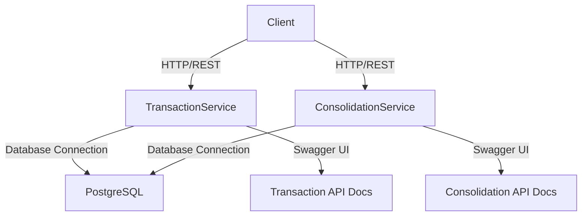

# DesafioArch
Desafio de arquitetura de soluções com o objetivo de desenvolver uma arquitetura que integre processos e sistemas com garantia a entrega e valor a organização

# Arquitetura da Solução

## Visão Geral
A solução é composta por dois microserviços independentes que gerenciam o fluxo de caixa de um comerciante:
- **TransactionService**: Responsável por gerenciar transações (débito e crédito) com operações CRUD.
- **ConsolidationService**: Gera relatórios diários de saldo, calculando o total acumulado de transações até uma data especificada.
- **Banco de Dados**: Um banco PostgreSQL compartilhado armazena todas as transações.

## Tecnologias
- **.NET 9**: Framework para desenvolvimento das APIs RESTful, escolhido por sua performance e suporte a microserviços.
- **PostgreSQL**: Banco de dados relacional robusto, ideal para transações financeiras consistentes.
- **Docker e Docker Compose**: Utilizados para containerização, garantindo consistência no ambiente local.
- **Swagger**: Ferramenta para documentação e teste das APIs.

## Requisitos Não Funcionais
- **Escalabilidade**: Cada serviço pode ser escalado horizontalmente de forma independente.
- **Resiliência**: A falha do ConsolidationService não afeta o TransactionService, desde que o banco de dados esteja disponível.
- **Desempenho**: Índices no banco de dados otimizam consultas para suportar 50 requisições por segundo no ConsolidationService.

## Diagrama de Arquitetura
O diagrama abaixo ilustra os componentes da solução e suas interações:



### Legenda do Diagrama
- **Client**: Usuário ou sistema externo que interage com os serviços via endpoints HTTP/REST.
- **TransactionService**: Microserviço para operações CRUD de transações (POST, GET).
- **ConsolidationService**: Microserviço para geração de relatórios diários (GET).
- **PostgreSQL**: Banco de dados relacional que armazena todas as transações.
- **Swagger UI**: Interface para documentação e teste das APIs, acessível em `/swagger`.

## Evoluções Futuras
Para melhorar a segurança da solução, é necessário abordar a exposição de senhas e credenciais atualmente definidas em texto simples nos arquivos `docker-compose.yml` e `appsettings.json`. Uma evolução planejada inclui a integração com um **gerenciador de segredos** (service manager), como:
- **AWS Secrets Manager**, **Azure Key Vault** ou **HashiCorp Vault** para armazenar credenciais sensíveis de forma segura.
- **Docker Secrets** para gerenciar senhas em ambientes conteinerizados.
Essa abordagem reduzirá os riscos de exposição de dados sensíveis, alinhando a solução com boas práticas de segurança.

## Passos para Montar o Desafio
1. Siga as instruções detalhadas no `setup.md` para configurar o ambiente e os projetos.
2. Implemente os modelos, controladores e contextos conforme descrito nos projetos TransactionService e ConsolidationService.
3. Configure o Swagger em ambos os serviços para documentação das APIs.
4. Implemente testes unitários nos projetos TransactionService.Tests e ConsolidationService.Tests.
5. Hospede o código em um repositório público no GitHub.

## Execução
- Execute o comando abaixo para iniciar os containers:
  ```bash
  docker-compose up --build
  ```
- Acesse as APIs via Swagger:
  - TransactionService: http://localhost:5000/swagger
  - ConsolidationService: http://localhost:5001/swagger